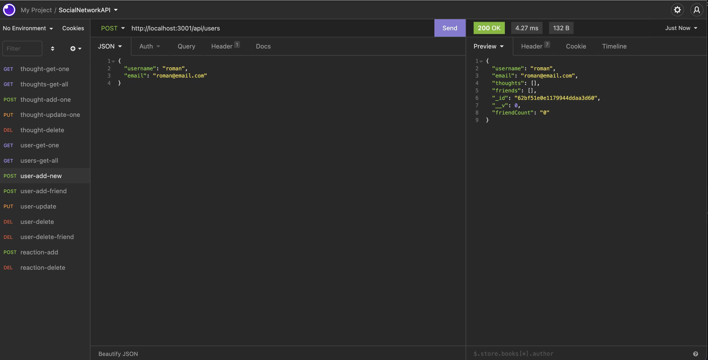
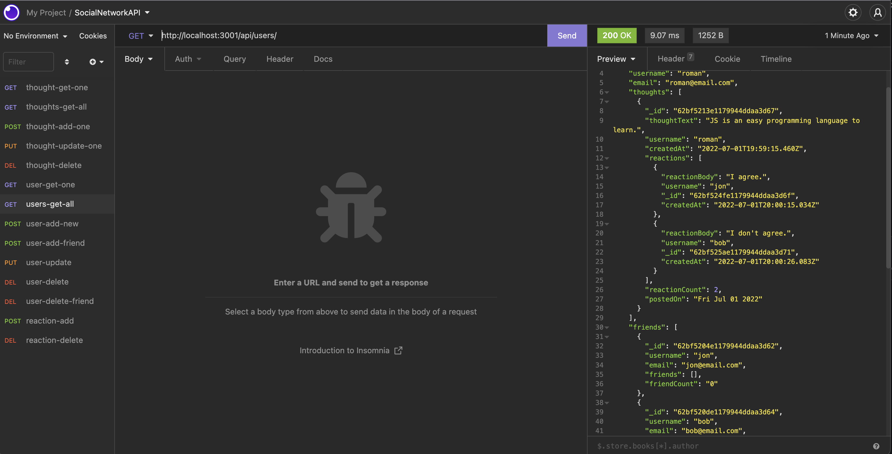
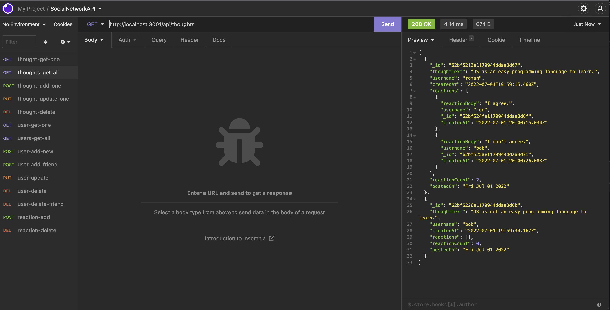
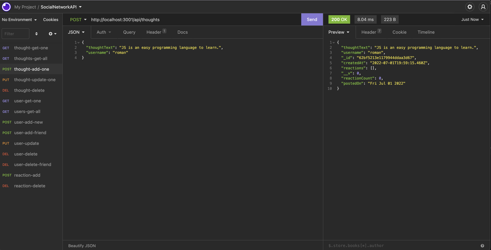

### MIT License

[](https://opensource.org/licenses/MIT)

## Description

A boilerplate for a social network API. It provides basic [CRUD](https://en.wikipedia.org/wiki/Create,_read,_update_and_delete) functionality to manage `Users`, `Thoughts`, `Reactions`. I used MongoDB as a backend datastore and [Mongoose](https://mongoosejs.com/) for ODM. The structure of the codebase loosely follows [MVC](https://en.wikipedia.org/wiki/Model%E2%80%93view%E2%80%93controller#:~:text=Model%E2%80%93view%E2%80%93controller%20and%20accepted%20from%20the%20user.) design pattern.

## Installation Instructions

> NOTE: Make sure you have `Node.JS ~v16.14.2` and `NPM ~8.11.0` installed. You can quickly check this by running `node -v` for Node.JS and `npm -v` for NPM in your terminal.

### Install local dependencies

Once the above is confirmed, go ahead and clone the repo `git clone git@github.com:rkutsel/social-network-api.git` and install local dependencies by running `npm install` in your terminal. A successful installation should look somewhat similar to the one bellow:

```bash
added 202 packages, and audited 203 packages in 1s

27 packages are looking for funding
  run `npm fund` for details

found 0 vulnerabilities
```

## Usage

To start the API server, form the `root` directory run `node index` or `npm start` which should fire up all of the components. Optionally you can run `npm run dev` for better dev experience. At this point you should be able to consume the API. You can use any API client. For the purpose of this example, I used [Insomnia Client](https://insomnia.rest/pricing) that has a free version.

## Model Structure

**User Model**:

- `username`

  - String
  - Unique
  - Required
  - Trimmed

- `email`

  - String
  - Required
  - Unique
  - Must match a valid email address. Email validator.

- `thoughts`

  - Array of `_id` values referencing the `Thought` model

- `friends`
  - Array of `_id` values referencing the `User` model (self-reference)

---

**Thought Model**:

- `thoughtText`

  - String
  - Required
  - Must be between 1 and 280 characters

- `createdAt`

  - Date
  - Set default value to the current timestamp
  - Use a getter method to format the timestamp on query

- `username` (The user that created this thought)

  - String
  - Required

- `reactions`
  - Array of nested documents created with the `reactionSchema`

---

**Reaction** (SCHEMA ONLY)

- `reactionId`

  - Mongoose's ObjectId data type
  - Default value is set to a new ObjectId

- `reactionBody`

  - String
  - Required
  - 280 character maximum

- `username`

  - String
  - Required

- `createdAt`
  - Date
  - Default value to the current timestamp
  - Getter method to format the timestamp on query

### API Routes

**`/api/users`**

- `GET` all users

- `GET` a single user by its `_id` and populated thought and friend data

- `POST` a new user:

- `PUT` to update a user by its `_id`

- `DELETE` to remove user by its `_id` **_along with associated thoughts_**.

---

**`/api/users/:userId/friends/:friendId`**

- `POST` to add a new friend to a user's friend list

- `DELETE` to remove a friend from a user's friend list

---

**`/api/thoughts`**

- `GET` to get all thoughts

- `GET` to get a single thought by its `_id`

- `POST` to create a new thought (don't forget to push the created thought's `_id` to the associated user's `thoughts` array field)

- `PUT` to update a thought by its `_id`

- `DELETE` to remove a thought by its `_id`

---

**`/api/thoughts/:thoughtId/reactions`**

- `POST` to create a reaction stored in a single thought's `reactions` array field

- `DELETE` to pull and remove a reaction by the reaction's `reactionId` value

## Screenshots





